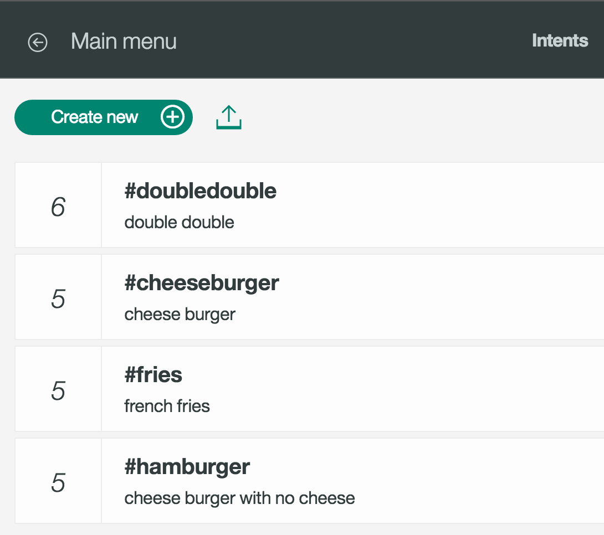
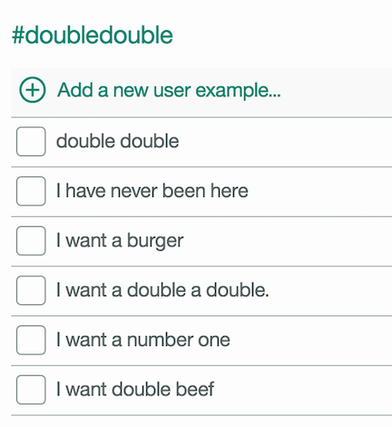
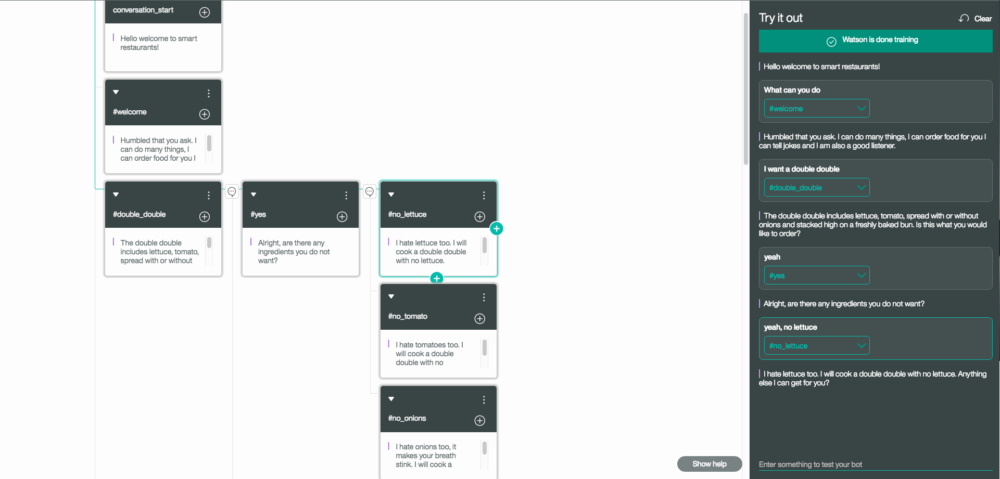
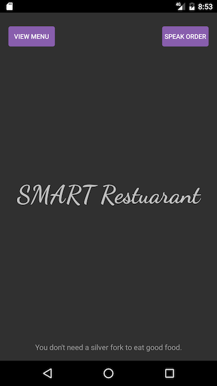
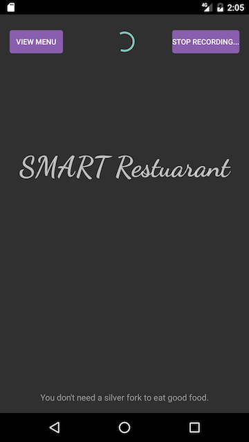
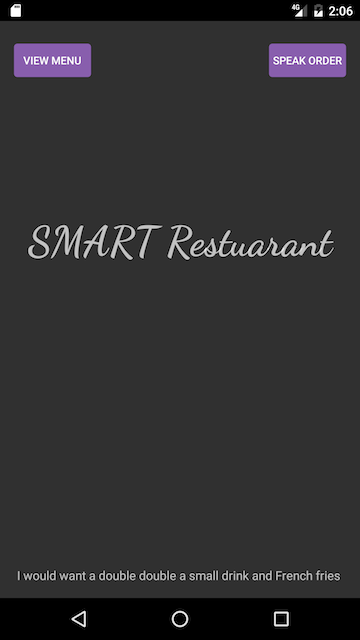
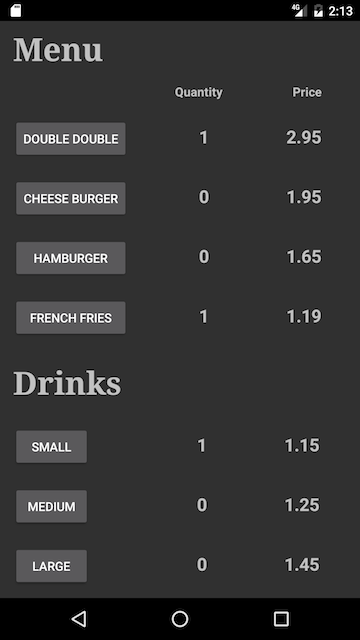
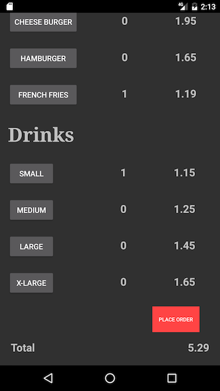
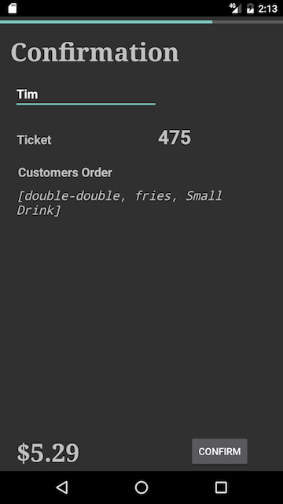

Smart Restaurants
======
SMART Restuarants is an Android Java application that facilitates restaurant owners by allowing their customers to order  through a mobile application. Currently the food menu we are using is the In-n-Out menu. The features the mobile application include are the following bluemix services. 

IBM Bluemix Services
======

###### Watson
   * Speech To Text (Complete) We use this service to allow Watson to listen to the customers order. 
   * Text To Speech (Complete) We use this service to allow Watson to repeat the order and total to the customer. 
   * Conversation (Coming Soon) We use this service to have a conversation between the customer and Watson. 
   
###### Data & Analytics
   * NoSql Bluemix Database (Complete) We use this service to send/receive customers order to the database.                          
   
###### Mobile
   * Push Notifications (Coming Soon) We use this service to notify the customer their order is complete. 
   
Conversation 
======
The approach we took was to split the In-n-Out menu into sub categories. In this case there are only two categories, Main-Menu and Drink-Size.In the Main-Menu the only items it contains are the following: Double-Double, Cheese Burger, Hamburger and Fries. The Drink-Size category only contains the size of the drinks: small, medium, large or x-lg. The reason we did this is because we are able assign a unique ID for the specific instance of interaction between Watson and the User. There is a process to order the food from In-n-Out. We first promt the user with the simple question, "What would you like to order from the Main Menu" we would look for relevent infomartion from the following intent:

 

In this specific category we have the main-menu as intents. And in each intent we have defined common statements a user may make for example #double-double:

The user may say "I want a double double" or say "I want a number 1".

 

Here is an example of the user ordering a double double. 
 

Cont. soon

Screenshots
======
 

Video
======
https://www.youtube.com/watch?v=8CZ30nZhz9k&feature=youtu.be

Useful links 
======
What is Watson? http://www.ibm.com/watson/

Contribute 
======
Go to the specific folder you want to contribute in i.e Website or Main. Then you can fork this folder and import through Android Studio.

Cook - Website Folder
======
View the README.md on the Website folder. In this folder we have implemented a website for the cook/chef to view when the customer places an order.

Restaurant Customer - Main Folder
======
In this folder we have implemented an Android Java Application for restuarant customers to place their orders manually or through speech. 

